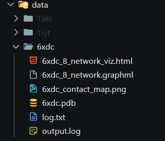
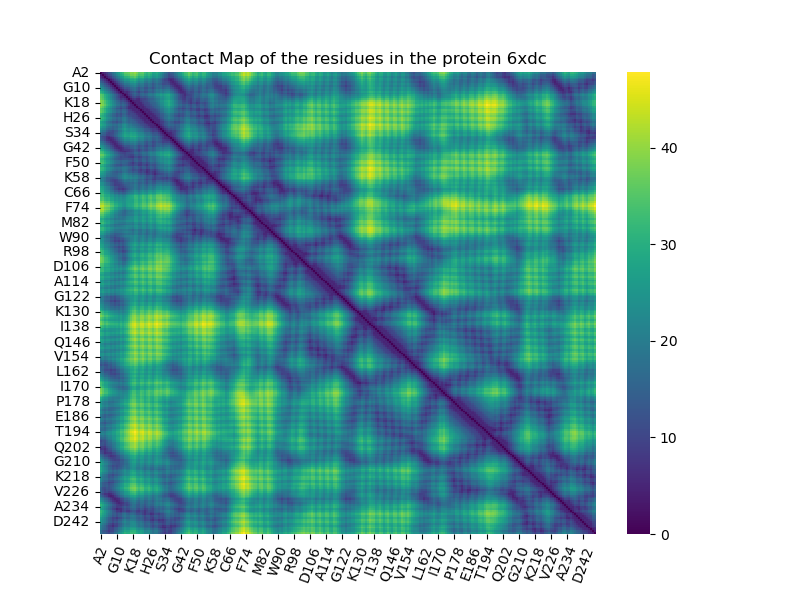
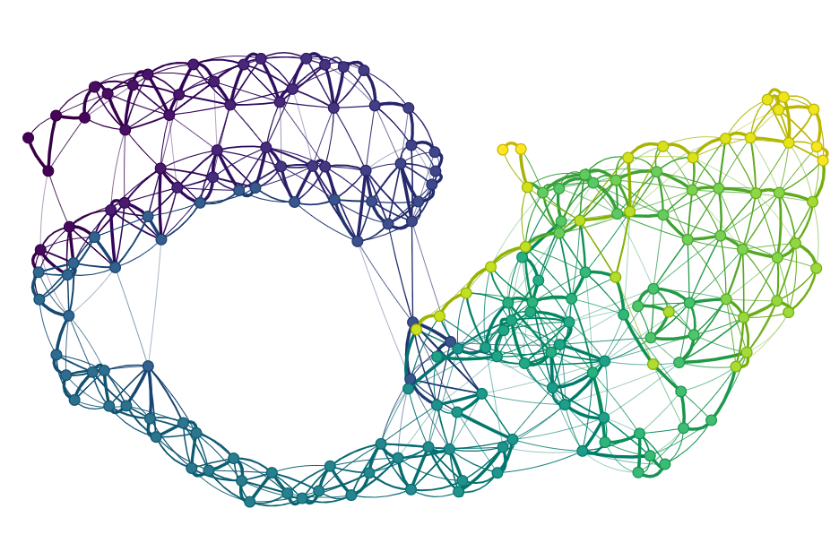

# Protein Structure Proximity Network

This project aims to create a network out of a protein structure stored in the standard PDB format.

The proximity network (in this context) of a protein is defined as a graph $G=(V, E)$ where $V$ is the set of amino acid residues (indexed) within the protein sequence and $E$ is the set of edges connecting these residues. An edge is established between two residues when they are close to each other, i.e., euclidean distance is small and will be taken $<8Å$ by default.


<!-- <iframe src="test/karate_graph.html" width="100%" height="600"></iframe> -->

## Installation

First clone this repository locally & enter it:

```bash
git clone https://github.com/raysas/protein-structure-proximity-network.git
cd protein-structure-proximity-network
```
### Dependencies:&nbsp;&nbsp;&nbsp;&nbsp;  

Install the following dependencies through pip: 

- Biopython
- NetworkX
- Pyvis
- Pandas
- Numpy
- Seaborn
- Matplotlib

```bash
pip install -r requirements.txt
```

### Running the code

#### 1. Through terminal (original)

The workflow takes from a use a pdb id to generate the network. All that has to be done is to run the following command on the terminal:

```bash
python code/generate_network.py <pdb_id>
```

Or if you wish to set the distance threshold to a different value, you can run:

```bash
python code/generate_network.py <pdb_id> <distance_threshold>
```

_Make sure you input a valid PDB id. Check [here](https://www.rcsb.org/docs/general-help/identifiers-in-pdb) for more info. You can also provide a pdb file path instead of an id, under testing - succesful trials so far._

#### 2. Import python module

If you wish you can run each function from extracting the pdb file to visualzing tee network by importing the python module and calling the functions.

```python
import sys
sys.path.append('<path-to-this-repo>/code')

from generate_network import *
```

#### 3. Run the Jupyter notebook on Colab

You can also run the code on a Jupyter notebook ([this file](./code/application.ipynb)) on Google Colab. Either add this repository to you google drive or connect it to github (might give issues without saving the PDB file anywhere).

***p.s.** this is a work in progress and the code is not yet optimized. More features to be added soon listed in the [to-do](./TODO.md) list*

### Output

In the data folder you will find a new directory of named by pdb_id after running

data  
 └──  pdb_id  
        &nbsp;&nbsp;&nbsp;&nbsp;&nbsp;&nbsp;&nbsp;&nbsp;├── output.log  
        &nbsp;&nbsp;&nbsp;&nbsp;&nbsp;&nbsp;&nbsp;&nbsp;├──pdb_id.pdb  
        &nbsp;&nbsp;&nbsp;&nbsp;&nbsp;&nbsp;&nbsp;&nbsp;├──pdb_id_contact_map.png  
        &nbsp;&nbsp;&nbsp;&nbsp;&nbsp;&nbsp;&nbsp;&nbsp;├──pdb_id_t_network.graphml  
        &nbsp;&nbsp;&nbsp;&nbsp;&nbsp;&nbsp;&nbsp; └──pdb_id_t_network_viz.html  

The output.log file contains the log of the process. The pdb_id.pdb file is the PDB structure of the protein. The pdb_id_contact_map.png is the contact map of the protein. The pdb_id_t_network.graphml is the network in graphml format. The pdb_id_t_network_viz.html is the interactive visualization of the network generated from `pyvixz`.

_Example run: building a network for [6xdc](https://www.rcsb.org/structure/6xdc)_

```bash
python code/generate_network.py 6xdc
```

The following changes will be made in the data folder:

<p align='center'>

</p>


After retrieving the PDB structure, it will extract residues and coordinates information to generate a contact map. The contact map is a heatmap of the distance between residues. Note that the coordinates for each residues are defined by the coordinates of their alpha carbon.


<p align='center'>

</p>

The network is then generated (by default threshold distance=8) and saved in graphml format. The network is also visualized in an interactive html file. The layout is set based on the x and y coordinates for each residues (plane z=0).


<p align='center'>

</p>

### Extensions

Subsequent analysis and visualization using softwares and tools like networkx, PyG, Gephi and CytoScape can be done out of the generated `.graphml` network file.

Recent works have been using protein structural networks to apply deep learning teachniques like Graph Neural Networks (GNNs) and Graph attention Networks (GATs) ([nature paper reference](https://www.nature.com/articles/s41467-023-43166-6)).


## References

Hamelryck, T., Manderick, B. (2003) PDB parser and structure class implemented in Python. Bioinformatics 19: 2308–2310

Hagberg, A., Swart, P. J., & Schult, D. A. (2008). Exploring network structure, dynamics, and function using NetworkX (No. LA-UR-08-05495; LA-UR-08-5495). Los Alamos National Laboratory (LANL), Los Alamos, NM (United States).

_This repository is licensed under the [MIT License](./LICENSE), contributions are welcome!_ 
<!-- wanna mention citation file -->
Don't forget to cite this repository if you use it in your work:

```bibtex
@software{Adam_Protein_structure_proximity,
author = {Adam, Rayane},
license = {MIT},
title = {{Protein structure proximity network generator}},
url = {https://github.com/raysas/protein-structure-proximity-network},
version = {1.0.0}
}
```